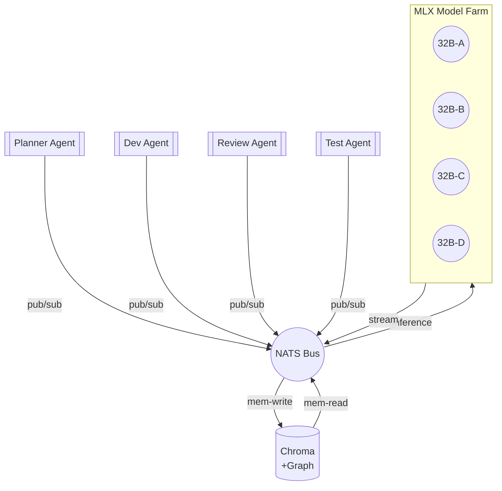

# Ultimate Memex RAG – Deep-Research Plan (v0.1)

import { Badge } from 'nextra/components'
import Sparkles from 'react-sparkle'

<Sparkles color="#ffbf00" count={30} minSize={8} maxSize={12} overflowPx={0} fadeOutSpeed={10} flicker />

## 🎆 Welcome to **Dragon Hyper-Stack** <Badge color="purple">Work-in-Progress</Badge>

> **Status:** Draft • Last updated <!--date--> <!--insert by CI-->

---

## 1 • Vision
**Build a self-hosted, hyper-fast Retrieval-Augmented-Generation platform for _LBRAXIS-Agents_** that:  
* fits entirely on Apple-Silicon hardware (Dragon M3 Ultra 512 GB)  
* serves  **≥20 concurrent agents** with ms-level memory access  & **local 32B models**  
* persists knowledge snapshots hourly, with cost-efficient cloud off-site backups  
* supports continuous fine-tune loops (LoRA) and dynamic plug-in skills.

---

## 2 • Hardware Profile
| Host | CPU | GPU | RAM | Storage | Role |
|------|-----|-----|-----|---------|------|
| **Dragon** | M3 Ultra (24 CPU) | 80-core GPU | 512 GB | 4 TB NVMe (APFS) | All core services |
| MBP #1-#4 | M-series (14-36 GB) | 10-18 GPU | 16-48 GB | 1-2 TB | UI + light agents |
| NAS (optional) | Apple Silicon mini | — | 32 GB | 20 TB RAID-Z | local tier-2 backups |

---

## 3 • Logical Architecture

---

## 4 • Software Components
### 4.1 MLX Runtime
* `mlx` + `mlx-lm` + `mlx-serving` 0.3
* 4× **32 B q6** models (≈ 22 GB each, ~25 tok/s)  
* gRPC / OpenAI-compatible REST (via `mlx-serving`)

### 4.2 RamLake Memory
* **Chroma v0.4** – in-memory HNSW, persisted to RAM-disk  
* **Neo4j-embedded** (or `networkx` with `pyarrow`) for directed knowledge graph  
* FastAPI wrapper exposing `/search_nodes`, `/graph/export`, `/graph/ingest`

### 4.3 Orchestrator & Agent Mesh
* Node 18 + TS + `nats.ws`  
* **Dynamic worker pool** – Docker-less, spawn via `child_process`  
* Skill routing table (JSON schema) maps intents → model instances / tools.

### 4.4 Ops Layer
* [`scripts/install-ramlake.sh`](../scripts/install-ramlake.sh) – provisions memory & backups  
* [`scripts/start-mcp-servers.js`](../scripts/start-mcp-servers.js) – launches all MCP servers  
* `launchd` plists stored in [`templates/launchd`](../templates/launchd)  
* **Grafana Cloud** (agent → Prom remote-write) for metrics

---

## 5 • RAG Data Flow
1. Agent publishes **`query.intent`** on NATS.  
2. Orchestrator retrieves top-_k_ (k≤25) embeddings from Chroma (`cosine`).  
3. Prompt template: _System + k chunks + user query_ (≤ 8 k tokens).  
4. `mlx-serving` streams tokens → Orchestrator.  
5. Response archived to RamLake (both text & embedding).  
6. Snapshot worker dumps graph + Chroma every hour.

---

## 6 • Sizing & Performance Targets
| Item | Metric | Target |
|------|--------|--------|
| End-to-end latency (RAG) | &lt; 1.5 s | for 1 k token answer |
| Throughput | ≥ 60 req/s | aggregated over 4 models |
| Memory usage | ≤ 150 GB | all processes loaded |
| Snapshot dump | ≤ 3 s | raw JSON ~200 MB |

---

## 7 • Security
* **API-Token** header for all local REST endpoints.  
* Mac Firewall allowlist `127.0.0.1` + trusted LAN IPs.  
* Backblaze IAM key limited to `ramlake-backup` bucket.  
* Secrets stored in **1Password CLI**; loaded into env via `op run`.

---

## 8 • Backups & DR
| Tier | Medium | Frequency | Retention |
|------|--------|-----------|-----------|
| L0 | RAM snapshot | 1 h | 3 d |
| L1 | SSD `/backups_persist` | 1 h | 30 d |
| L2 | Backblaze B2 (gz) | 3 h | 180 d |
| L3 | Offline HDD (NAS) | weekly | 1 y |

Restore script `scripts/restore-ramlake.sh` will re-hydrate Chroma & graph from any tier.

---

## 9 • Cost Estimate (monthly)
| Resource | Qty | Unit Cost | Total |
|----------|-----|----------|-------|
| Backblaze B2 storage | 30 GB | $0.005/GB | **$0.15** |
| B2 egress (rare) | 5 GB | $0.01/GB | $0.05 |
| Grafana Cloud (free tier) | — | $0 | $0 |
| Electricity (Dragon idling) | 30 W × 720 h × 0.2€/kWh | ≈ €4.3 |
| **Total** |  |  | **< €5/mo** |

---

## 10 • Implementation Roadmap
| Stage | Deliverables | ETC |
|-------|--------------|----|
| **MVP (Week 1)** | NATS bus, 1× MLX model, Orchestrator ping/pong, RamLake search (<Badge color="green">`scripts/orchestrator/index.ts`</Badge>) | 5 d |
| **v0.5 (Week 2-3)** | 4 models, Agent CRUD, hourly snapshots, Backblaze sync (<Badge color="orange">`scripts/backup_memory.sh`</Badge>) | 10 d |
| **v0.9 (Week 4-6)** | UI dashboard, LoRA loader, metrics & alerting | 15 d |
| **v1.0** | Fine-tune pipeline, knowledge-curator agent, docs published | 7 d |

---

## 11 • Open Research Questions
1. **Context compression** – Cobble or JWT-packed embeddings to keep prompts ≤ 32 k.  
2. **Graph-aware RAG** – combine path search in Neo4j with vector search.  
3. **LoRA on-the-fly** – hot-merge LoRAs per-agent without full reload (MLX API?).  
4. **Peer-to-peer GPU pooling** – can MBP nodes borrow Dragon GPU VRAM over Metal-link?

---

## 12 • References
* [MLX – Machine Learning eXchange](https://github.com/ml-explore/mlx)  
* [ChromaDB HNSW](https://docs.trychroma.com/)  
* [NATS.io](https://nats.io/) – lightweight, Kotlin-simple pub/sub  
* [Backblaze B2 Docs](https://www.backblaze.com/docs/)  
* Apple Metal Performance shaders reference (MPSGraph).

---

> _"The best way to predict the future is to build it."_ – **Alan Kay**

---

export const meta = {  
  title: "Ultimate Memex RAG Plan",  
  draft: true  
} 